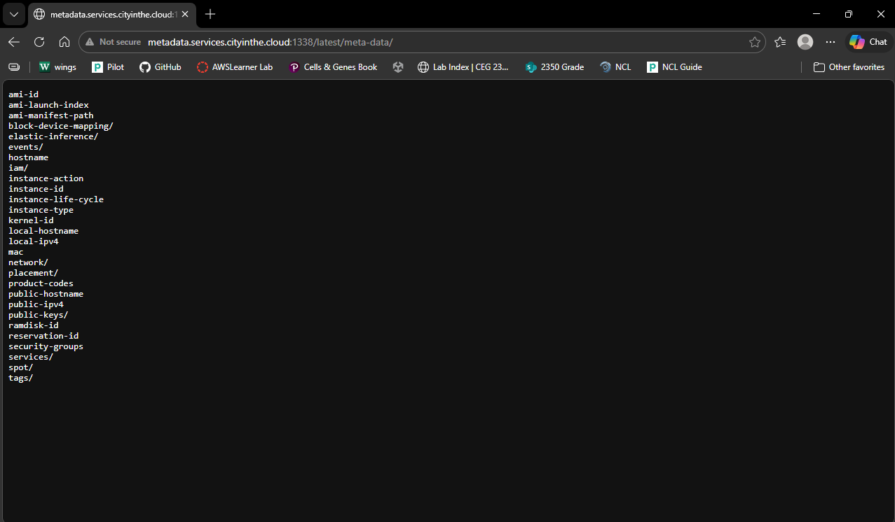
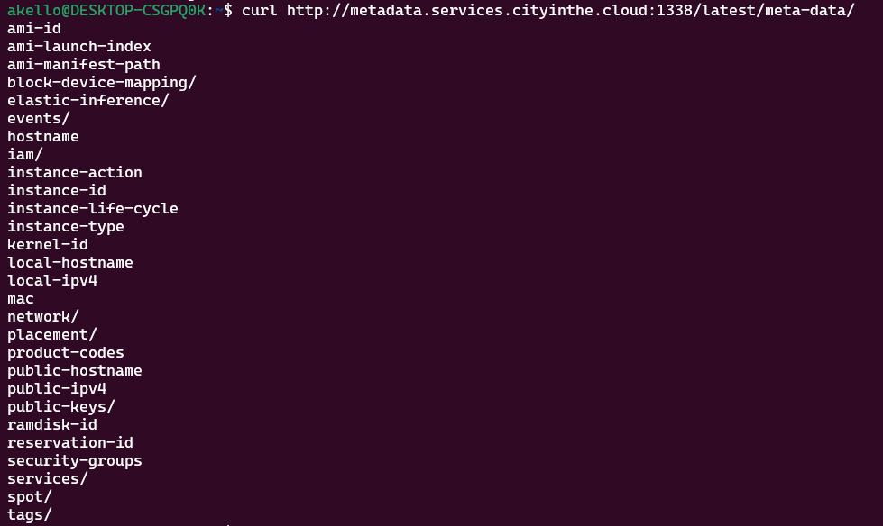

## Metadata

This challenge involves querying the server’s [AWS Instance Metadata](https://docs.aws.amazon.com/AWSEC2/latest/UserGuide/instancedata-data-retrieval.html) Service. The instance metadata service is implemented on all AWS EC2 (their virtual machine product offering) instances and is implemented as a basic HTTP server. To access the service and retrieve the metadata, make HTTP requests per the document endpoints listed in the instance metadata service documentation. The full list of endpoints is available via: https://docs.aws.amazon.com/AWSEC2/latest/UserGuide/instancedata-data-categories.html

# Retrieving Metadata

You can access the meta-data endpoint by appending it this URL `http://[hostname]:[port]/latest/meta-data` and see what other endpoints exist. To make a request to retrieve the metadata, you can use either your browser as the HTTP client and type the URL into the browser’s address bar or you can use a command line HTTP client such as curl.

Web browser

curl can be used to retrieve html data on the command line

# Questions

1. What availability zone is this instance hosted in?
Access the placement/availability-zone endpoint

`curl http://metadata.services.cityinthe.cloud:1338/latest/meta-data/placement/availability-zone`

us-west-2a

2. What is the security credentials role named?
Access the iam/security-credentials endpoint

`curl http://metadata.services.cityinthe.cloud:1338/latest/meta-data/iam/security-credentials`

liber8-role

3. What is the instance type being used?
Access the instance-type endpoint

`curl http://metadata.services.cityinthe.cloud:1338/latest/meta-data/instance-type`

c6g.16xlarge

4. What is the operating system name and version number?
Access the ami-id endpoint first, then from there, look up the ID on Google which should show you that it’s an Ubuntu AMI ID which you can verify on https://cloud-images.ubuntu.com/locator/ec2/ 

id: `ami-08305dd8ab642ad8c`

Name: `Xenial Xerus`	
Version: `16.04 LTS`

5. What is the flag?
This is the most challenging question as it will require you to scan and enumerate all the possible endpoints until you find something that shows a flag. As you scan through all the endpoints, you may reach the network/interfaces/macs endpoint which will print out the MAC address of the network interface on the machine. From there, continue to access the endpoint using network/interfaces/macs/[mac address] and enumerate all the possible additional endpoints from there until you reach network/interfaces/macs/[mac address]/vpc-ipv4-cidr-blocks which is hosting a hidden flag.

`curl http://metadata.services.cityinthe.cloud:1338/latest/meta-data/network/interfaces/macs/0e:49:61:0f:c3:11/vpc-ipv4-cidr-blocks`

The flag is : SKY-AWSM-1570