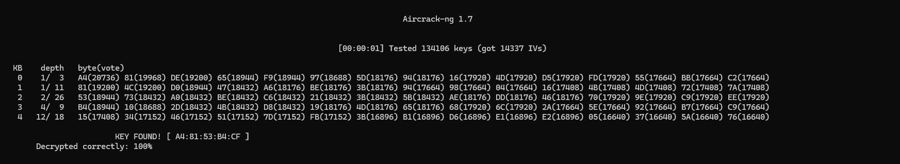
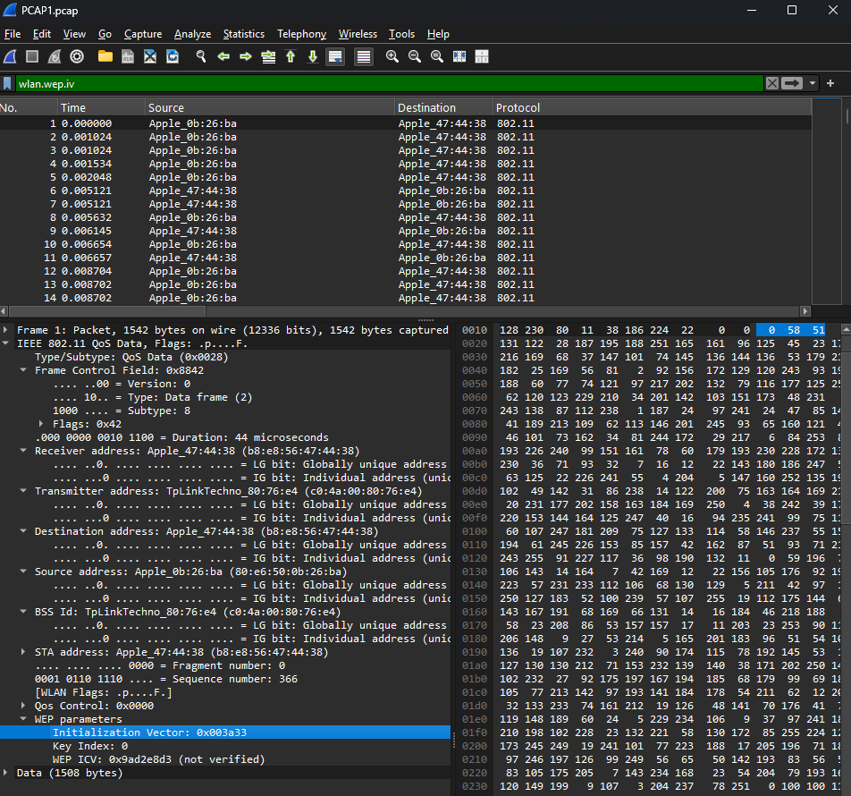
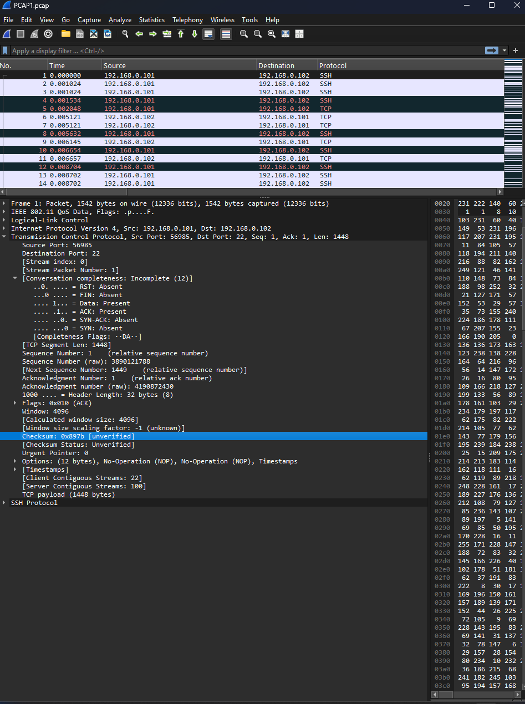
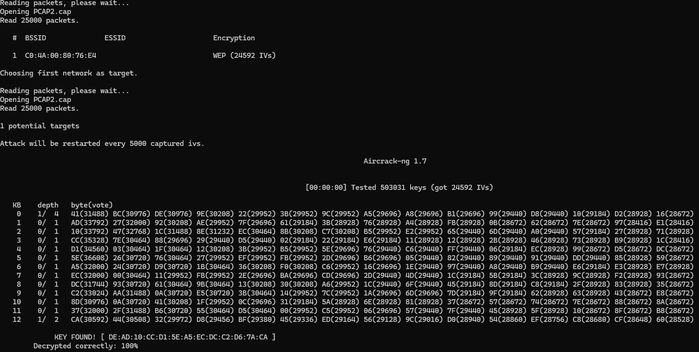
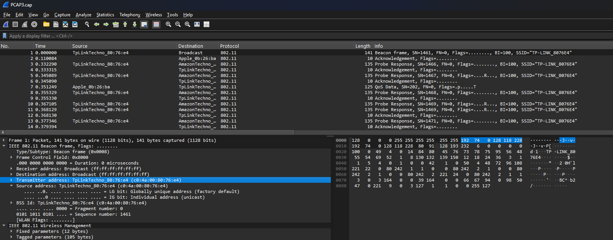
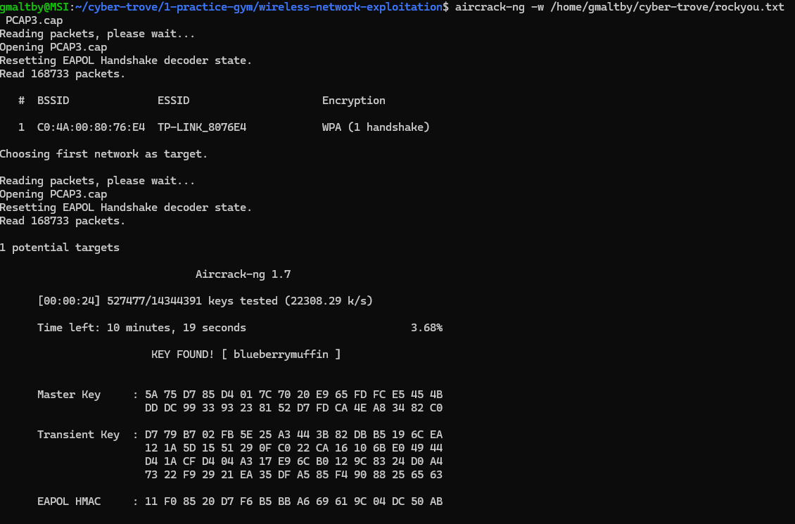

## Wireless Access Exploitation

Tools needed for this challenge: aircrack-ng `sudo apt install aircrack-ng`  

1. How many IVs are in the packet capture?  
14337

Commands used:  
`aircrack-ng PCAP1.pcap`  
  
  

2. What is the key size of the wireless network data encryption method in bits?  
64  

The key size can be determined by counting the number of bits in the key text (5 bytes * 8 bits per byte = 40 bits) and comparing that to the possible WEP key sizes (64 bit WEP contains a 40-bit key and a 24-bit initialization vector which forms the final 64-bit RC4-based key for WEP).

3. What is the IV for the first packet in the capture in hexadecimal representation?  
0x003a33  

Open `PCAP1.pcap` file in Wireshark  
Click the first frame. In the filter bar type `wlan.wep.iv`
In the lower left window, expand `IEEE 802.11`. Expand `WEP parameters`. Initialization Vector: 0x003a33

  

4. What is the WEP key?  
A4:81:53:B4:CF

5. What is the TCP checksum, in hexadecimal representation, of the first packet in the capture?
0x897b

We found the key in question 4. In Wireshark go to Edit-Preferences-Protocols-IEEE 802.11, check enable decryption and add the key `A4:81:53:B4:CF`. Now that the traffic is decrypted, you can access the TCP fields. Click on the first packet, expand Transmission Control Protocol, near the bottom you'll see `Checksum:`.

  

## WiFI PCAP2 (Medium)  

1. How many IVs are in the packet capture?  
24592 IVs  

  

2. What is the key size of the wireless network data encryption method in bits?  
128 bit

3. What is the IV for the first packet in the capture in hexadecimal representation?  
0x0994ff

4. What is the WEP key?  
DE:AD:10:CC:D1:5E:A5:EC:DC:C2:D6:7A:CA  

5. What is the TCP checksum, in hexadecimal representation, of the first packet in the capture?  
0x08f0  

## WiFi PCAP3 (Hard)  

1. What is the MAC address of the router?  
`c0:4a:00:80:76:e4`  

  

2. What is the ESSID (name of network) of the wifi network?  
`TP-LINK-8076E4`  

3. What is the password for the wireless network?  
`blueberrymuffin`

The `-w` specfies a word list.  
`aircrack-ng -w /home/gmaltby/cyber-trove/rockyou.txt PCAP3.cap`  

  
4. What is the IP address of the router?  
`192.168.0.254`

5. What company manufactured the router? 
`TP-LINK`

6. What is the model of the router?  
`WR702N`  

Enter `tcp.stream eq 0` in the display filter.
Right click "follow tcp stream"

7. What firmware version is installed on the router?
`4.19.1 Build 130528 Rel.52704n  `

Enter `tcp.stream eq 47` in the display filter.  

8. What release number is the router using?  
`52704n`  

9. What is the IP address of the user who logged into the router admin panel?  
`192.168.0.101`

10. What is the MAC address of the first victim of the deauth attack?  
`b8:e8:56:47:44:38`

filter used: `wlan.fc.type_subtype eq 12`
```
In Wireshark, the filter wlan.fc.type_subtype eq 12 is used to isolate a specific type of management frame in a wireless network: the Deauthentication (Deauth) frame.

Here is a breakdown of what the components of this command mean:

wlan: This specifies the IEEE 802.11 wireless LAN protocol.

.fc: This stands for Frame Control, a field within the MAC header that contains control information for the frame.

.type_subtype: This refers to the combined value of the "Type" and "Subtype" fields.

In 802.11, Type 0 indicates a Management Frame.

The Subtype 12 (often represented in hex as 0x0c) specifically identifies the Deauthentication subtype.

eq 12: This is the operator "equal to," telling Wireshark to only display packets where the type/subtype value matches 12.
```

11. What is the MAC address of the second victim of the deauth attack?  
`80:e6:50:0b:26:ba`